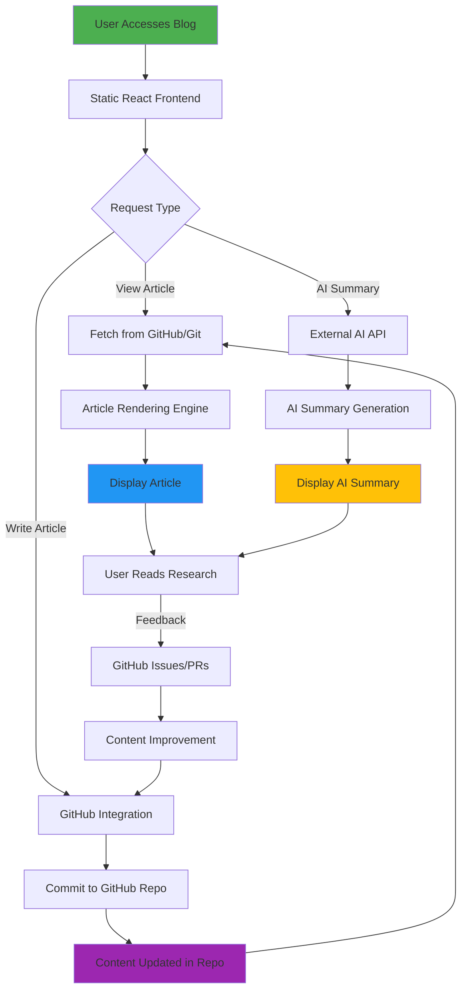

# Dan Papers

<div align="center">

[](https://reactjs.org/)
[](https://www.typescriptlang.org/)
[](https://vitejs.dev/)
[](https://tailwindcss.com/)

*A minimalist approach to publishing research in the age of noise.*

</div>

## 🌟 Overview

Dan Papers is a clean, distraction-free platform designed for presenting research clearly and beautifully. In a world saturated with notifications, sidebars, and algorithmic feeds, Dan Papers focuses on one thing: the transmission of knowledge through well-formatted, readable content.

## ✨ Features

- **Minimalist Design**: Clean typography and layout optimized for readability
- **No Distractions**: No ads, no social media integration, no gamified metrics
- **AI Summary Integration**: Built-in AI-powered content summarization (configurable)
- **GitHub Integration**: Direct publishing and editing capabilities
- **Responsive Layout**: Optimized for all device sizes
- **Fast Loading**: Optimized performance and asset loading

## 🏗️ Architecture

The application follows a modern React architecture with the following key components:

```
src/
├── components/          # React UI components
│   ├── ArticleCard.tsx  # Article preview cards
│   ├── ArticlePage.tsx  # Article detail view with AI summary
│   ├── Navbar.tsx       # Navigation header
│   └── WritePage.tsx    # Article creation interface
├── services/            # API and external service integrations
├── constants.ts         # Application data and user configuration
├── types.ts             # TypeScript type definitions
└── App.tsx              # Main application component
```

### Framework Workflow



### Key Technologies:
- **Frontend**: React 19.2.3 with TypeScript
- **Build Tool**: Vite 6.2 for fast development
- **Styling**: Tailwind CSS for utility-first styling
- **Icons**: Lucide React for consistent iconography
- **Routing**: React Router DOM for navigation
- **State Management**: React hooks for local state management

### API Integration:
The application is designed with API extensibility in mind, allowing for various AI services to be integrated for content summarization. The architecture is modular and can work with different AI providers.

## 🚀 Getting Started

### Prerequisites
- Node.js 18+ 

### Installation
1. Clone the repository:
   ```bash
   git clone <your-repo-url>
   cd dan-papers
   ```

2. Install dependencies:
   ```bash
   npm install
   ```

3. Set up environment variables:
   ```bash
   cp .env.local.example .env.local
   # Edit .env.local with your API keys
   ```

4. Run the development server:
   ```bash
   npm run dev
   ```

5. Open [http://localhost:3000](http://localhost:3000) in your browser

## 🔧 Configuration

The application can be customized by modifying:

- `constants.ts` - User information and default articles
- `.env.local` - API keys and environment-specific settings
- `index.html` - HTML template and metadata
- `index.css` - Custom CSS overrides

## 📄 License

This project is licensed under the MIT License - see the [LICENSE](LICENSE) file for details.

## 🤝 Contributing

Contributions are welcome! Please feel free to submit a Pull Request.

## 🐙 GitHub Integration

The application includes built-in GitHub integration for direct publishing and editing capabilities. Users can authenticate with GitHub tokens to manage content directly.

---

<div align="center">

*Built with ❤️ for the research community*

</div>